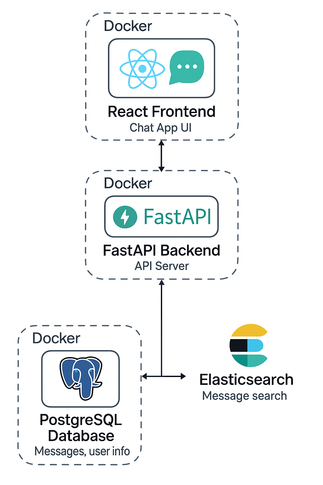

# Chat App

 

# Chat App

<p align="center">
  
</p>

A modern and intuitive real-time chat web app. Users can register, log in, create chat rooms, add friends, send messages, and search conversations. Built with FastAPI, React, PostgreSQL, Elasticsearch, and Docker Compose for easy local or cloud deployment.


---

## Table of Contents

1. [Features](#features)
2. [Tech Stack](#tech-stack)
3. [Architecture](#architecture)
4. [Prerequisites](#prerequisites)
5. [Getting Started](#getting-started)
6. [Project Structure](#project-structure)
7. [Development Scripts](#development-scripts)
8. [Common Issues & Troubleshooting](#common-issues--troubleshooting)
9. [Contributing](#contributing)
10. [License](#license)

---

## Features

* **User Authentication**: Signup and login functionality
* **Real-Time Messaging**: Powered by Socket.IO for instant chat
* **Multiple Chat Rooms**: Create or join different chat rooms
* **Persistent Storage**: PostgreSQL to store users and messages
* **Search**: Elasticsearch integration for message search
* **Dockerized**: Easy setup and deployment with Docker Compose

## Tech Stack

* **Backend**: Python, FastAPI, Socket.IO, Uvicorn
* **Frontend**: React, Material-UI
* **Database**: PostgreSQL
* **Search**: Elasticsearch
* **Containerization**: Docker, Docker Compose

## Architecture



A modern and intuitive real-time chat web app. Users can register, log in, create chat rooms, add friends, send messages, and search conversations. Built with FastAPI, React, PostgreSQL, Elasticsearch, and Docker Compose for easy local or cloud deployment.

## Prerequisites

* [Docker](https://www.docker.com/get-started)
* [Docker Compose](https://docs.docker.com/compose/install/)
* [Git](https://git-scm.com/downloads)

## Getting Started

1. **Clone the repository**

   ```bash
   git clone https://github.com/your-username/chat-app.git
   cd chat-app
   ```

2. **Environment Variables**

   Environment files are located per service:

   * **backend/.env** (example: `.env.txt`)
   * **frontend/.env.local**

   Example (`backend/.env`):

   ```dotenv
   POSTGRES_USER=postgres
   POSTGRES_PASSWORD=postgres
   POSTGRES_DB=chat
   POSTGRES_HOST=database
   POSTGRES_PORT=5432
   SECRET_KEY=your_secret_key_here
   ALGORITHM=HS256
   ES_HOST=http://elasticsearch:9200
   ```

   Example (`frontend/.env.local`):

   ```dotenv
   REACT_APP_SOCKET_SERVER_URL=http://localhost:4000
   ```

3. **Build and Run**

   ```bash
   docker-compose up --build
   ```

4. **Access the Application**

   * Frontend: [http://localhost:3000](http://localhost:3000)
   * Backend API Docs: [http://localhost:4000/docs](http://localhost:4000/docs)

## Project Structure

```

├── backend/ # FastAPI backend microservice
├── elasticsearch/ # Elasticsearch microservice
├── frontend/ # React frontend microservice
├── docs/ # Project documentation & diagrams
├── docker-compose.yml # Docker Compose setup
```

## Development Scripts

### Backend (Local without Docker)

```bash
cd backend
pip install -r requirements.txt
uvicorn app.main:app --reload --host 0.0.0.0 --port 4000
```

### Frontend (Local without Docker)

```bash
cd frontend
npm install
npm start
```

## Common Issues & Troubleshooting

* **Permission denied: react-scripts**

  * Run `chmod -R 755 frontend/node_modules/.bin` or rebuild the frontend image.
* **Database Connection Errors**

  * Verify that the `database` service is running and environment variables match.
* **Elasticsearch Not Starting**

  * Check `elasticsearch/config/` files and adjust heap settings if necessary.
* **Environment Variables Not Loading**

  * Ensure `.env` and `.env.local` are in place and Docker Compose is configured to load them.
* **Backend Service Fails to Start**

  * If `docker-compose up` doesn’t always spin up the backend, run:

    ```bash
    docker-compose up -d backend
    ```

